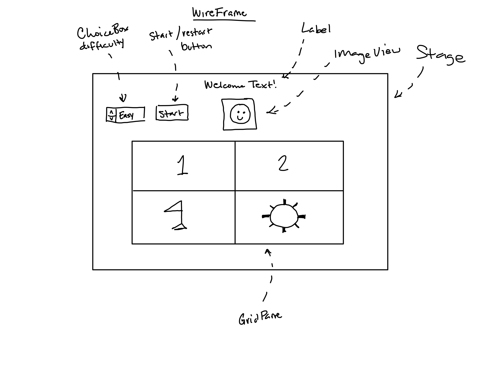

# UD3 - Minesweeper Game

For this project, I've made a minesweeper game. Minesweeper is an old game that Windows computers came with, along with Solitaire and Space Pinball. This is one of many games that hold a lot of nostalgia for me. I decided to make this game because I feel that the gameplay is relatively simple to understand but challenging enough to implement.

## Wireframe

## UML Diagrams
